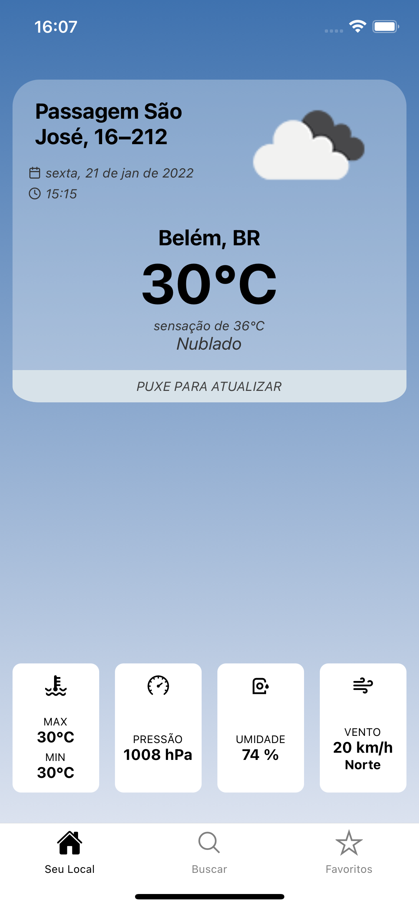
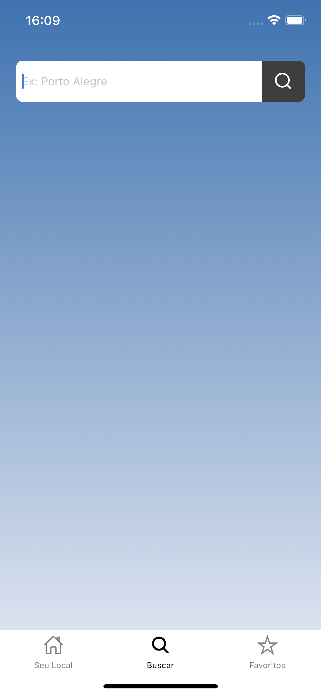
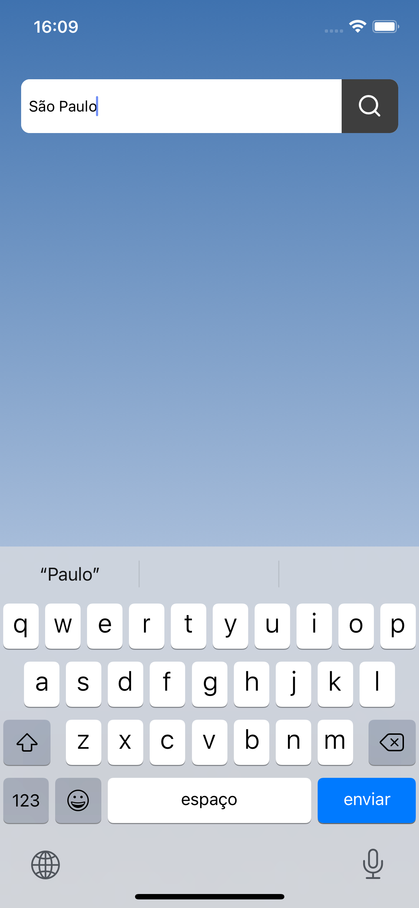
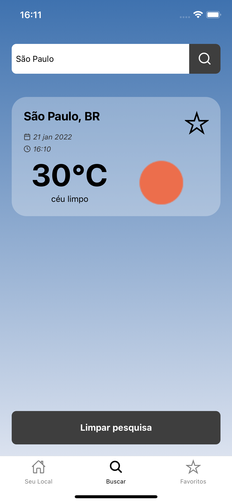
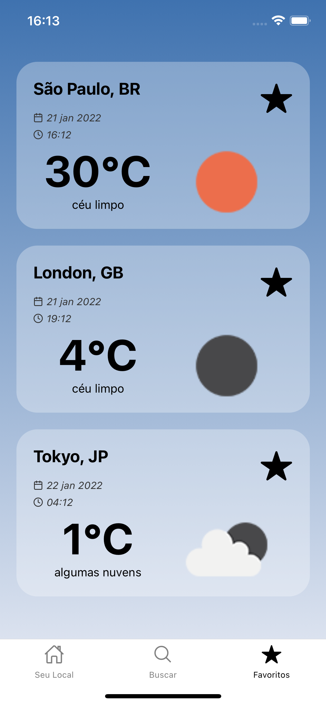
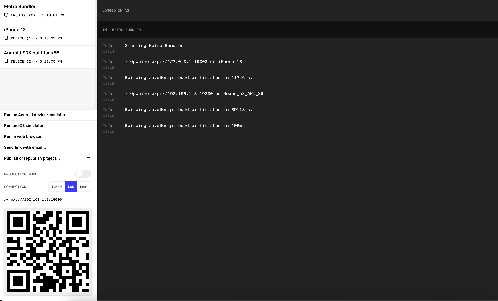

<h1 align="center">
    
    <br>
    Weather Builders App
</h1>
<h4 align="center">
  Projeto desenvolvido como teste técnico, fazendo parte do processo seletivo para desenvolvedor React Native.
</h4>
<p align="center">
<a href="#imagens">Imagens</a>&nbsp;&nbsp;&nbsp;|&nbsp;&nbsp;&nbsp;
  <a href="#como-funciona-o-app">Como Funciona o App</a>&nbsp;&nbsp;&nbsp;|&nbsp;&nbsp;&nbsp;
  <a href="#tecnologias">Tecnologias utilizadas</a>&nbsp;&nbsp;&nbsp;|&nbsp;&nbsp;&nbsp;
  <a href="#como-executar">Como executar</a>&nbsp;&nbsp;&nbsp;|&nbsp;&nbsp;&nbsp;
  <a href="#testes">Testes</a>
</p>

## Imagens

<p float="left">






</p>

## Como Funciona o App

### <b>Home (Seu Local)</b>

Na home (Seu Local), o app utiliza a sua localização atual e exibe seu endereço aproximado e os dados climáticos atuais da região, como temperatura máxima e mínima, pressão atmosférica, umidade relativa do ar, direção e velocidade do vento entre outros.

### <b>Buscar</b>

Na aba de busca (Buscar), você pode pesquisar pelo nome da cidade desejada. Nesse momento, o app exibe na tela os dados de data e hora local da cidade em questão, além dos dados climáticos.

Nesta etapa, você pode adicionar uma cidade como favorita, evitando que você sempre pesquise pelas cidades que você deseja. Para visualizar as cidades favoritas, acesse a aba Favorito.

Caso você faça a busca por uma cidade que já se encontra nos seus favoritos, o app identifica que ela existe e disponibiliza a possibilidade de removê-la da sua lista, sem precisar navegar para a aba de favoritos.

### <b>Favoritos</b>

Na aba de Favoritos, você tem uma lista de todas as cidades que você marcou como favorita. Nesse momento, você também pode remover um favorito, deixando apenas as cidades que você deseja.

## Tecnologias utilizadas

- [React Native](https://reactjs.org/)
- [Expo](https://docs.expo.dev)
- [Expo Linear Gradient](https://docs.expo.dev/)
- [Expo Location](https://docs.expo.dev/)
- [Expo Status Bar](https://docs.expo.dev/)
- [React Content Loader](https://skeletonreact.com/)
- [Typescript](https://www.typescriptlang.org/)
- [Styled Components](https://styled-components.com/)
- [Axios](https://github.com/axios/axios)
- [React Hooks](https://pt-br.reactjs.org/docs/hooks-intro.html)
- [Context API](https://pt-br.reactjs.org/docs/context.html)
- [Dotenv](https://github.com/motdotla/dotenv)
- [React Native SVG](https://github.com/react-native-svg/react-native-svg)
- [React Navigation](https://reactnavigation.org/)
- [Testing library](https://testing-library.com/)
- [Jest](https://jestjs.io/)

## Como executar

Requisitos:

- [Expo](https://docs.expo.dev/get-started/installation/)

Siga as intruções abaixo utilizando sua linha de comando.

### Baixando o projeto

<i>Com o seu console de linha de comando preferido, execute:</i>

```bash
# Clone o repositório
$ git clone https://github.com/hardzork/weather-builders-app.git
```

<i>Após o download concluído, </i>

```bash
# Vá para o repositório do app
$ cd weather-builders-app

# Instale as dependências
$ yarn

# Execute o projeto
$ yarn start
```

Nesse momento, o seu navegador padrão abrir uma página parecida com a mostrada abaixo:



Nesse momento você pode utilizar o emulador de sua preferência. Basta clicar em "Run on Android device/emulator" ou "Run on iOS simulator" (somente em MacOS).

## Testes

Para executar os testes automatizados siga as instruções abaixo

```bash
# Execute os testes
$ yarn test
```

## Contato

Robinson Silva Junior - [Github](https://github.com/hardzork)
